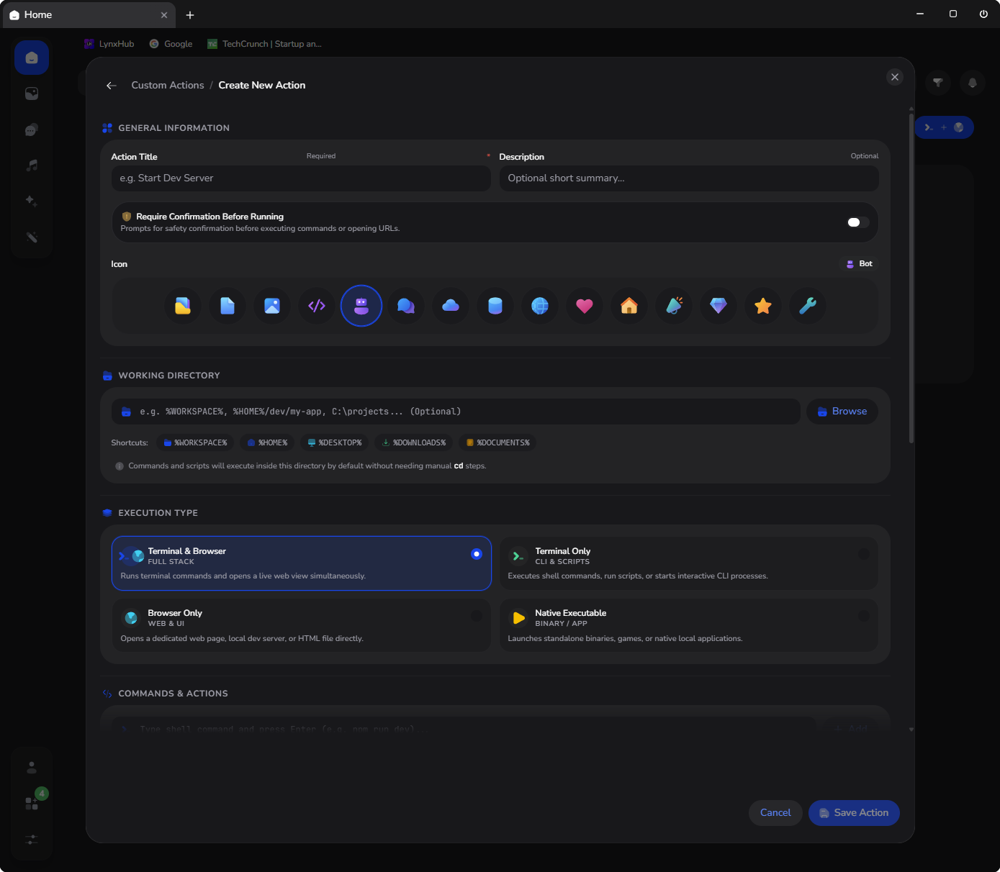

  

# [LynxHub](https://github.com/KindaBrazy/LynxHub) Custom Actions

A feature-rich automation extension for the [LynxHub](https://github.com/KindaBrazy/LynxHub) desktop application that
enables you to build, customize, and orchestrate interactive action cards. Create tailored developer shortcuts to
automate scripts, launch local development servers, manage CLI pipelines, parameterize runtime variables, and
streamline your daily workflows with a single click.

## ✨ Key Features

- 🎯 **Dynamic Template Variables (`{{VAR}}`)**: Parameterize commands, scripts, URLs, and environment variables with
  flexible runtime placeholder syntax (`{{VAR}}` or `{{VAR:default}}`). Automatically launches an interactive
  parameter modal on run with live command previews and instant reset controls.
- 🛡️ **Pre-Execution Safety Confirmation**: Built-in guard modal for sensitive or destructive operations with custom
  warning messages and full command/URL reviews before execution.
- ⚡ **Live Process Tracking & Stop Controls**: Real-time execution indicators with pulsating status rings, background
  status badges, 1-click active session navigation, and direct process interrupt/termination controls.
- 📂 **Card Working Directory & Path Shortcuts**: Configure execution directories with 1-click system path shortcut
  tokens (`%WORKSPACE%`, `%HOME%`, `%DESKTOP%`, `%DOWNLOADS%`, `%DOCUMENTS%`, `%APPDATA%`, `~`) and live path
  resolution previews.
- 🔄 **Drag-and-Drop Execution Pipeline**: Chain multiple actions in sequence—run shell commands, execute scripts
  (`.py`, `.js`, `.bat`, `.sh`, `.ps1`, `.command`), launch binaries, or open files/folders. Reorder steps with smooth
  drag-and-drop, toggle steps on/off without deleting, duplicate steps, and edit commands inline.
- 🌐 **Flexible Browser & Web Tab Integration**:
  - **Custom URLs**: Open direct HTTP/HTTPS or localhost addresses immediately or after a configurable delay.
  - **Local HTML Files**: Select local `.html`/`.htm` files in your workspace with automatic `file://` formatting.
  - **Terminal Output Log Scanning**: Auto-detect dynamically assigned server ports and URLs directly from live
    terminal stdout streams (e.g. Vite, FastAPI, Django, Flask).
- 🔐 **Custom Environment Variables**: Define custom `KEY=VALUE` environment variables per card, automatically exported
  into terminal sessions and executable processes across Windows and Unix platforms.
- 📦 **Import, Export & Batch Management**:
  - Export and import custom action cards via JSON files or clipboard with schema validation and sanitization.
  - Floating multi-select batch action bar for bulk category assignment, batch duplication, export, and deletion.
- 🗂️ **Smart Categorization & Instant Search**: Organize cards into LynxHub categories (Pinned, Recently Used, All,
  Image, Text, Audio), toggle pin state directly from cards, and filter cards with real-time multi-field search.
- 🎨 **Modern HeroUI v3 & Solar Icons Design**: Built with HeroUI v3, Solar Icons v2, Framer Motion animations, and
  seamless dark/light theme integration.

---

## 🚀 Card Types

| Type | Description |
| :--- | :--- |
| **`Terminal & Browser`** | Executes automated terminal commands/scripts while concurrently opening or auto-tracking a browser tab. |
| **`Terminal`** | Runs interactive or automated shell commands and script files in a LynxHub terminal session. |
| **`Browser`** | Opens a standalone browser view for remote URLs or local HTML files without starting a terminal process. |
| **`Executable`** | Launches standalone desktop binaries/executables directly with custom environment variables and working directory. |

---

## 📥 Installation

1. **[Install LynxHub](https://github.com/KindaBrazy/LynxHub):** Make sure you have LynxHub installed on your system.
2. **Install Extension:** Open LynxHub, navigate to the **Plugins / Extensions** page, and enable the **Custom Actions**
   extension.

---

## 📄 License

This project is licensed under the MIT License. See the [LICENSE.md](LICENSE.md) file for details.
